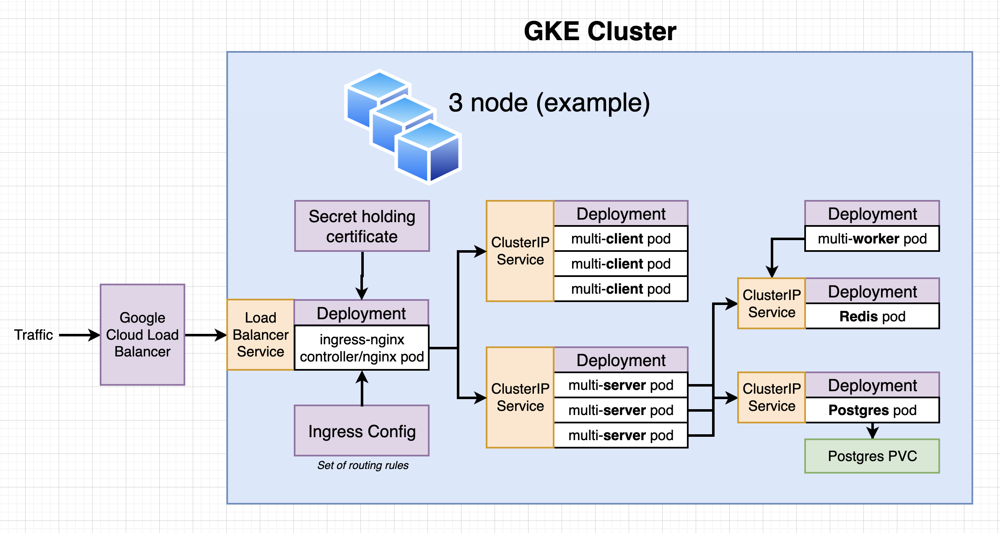

# Multi-tiered React node.js application on GCP utilizing GKE (Kubernetes) deployments of Docker containerization

This is a Fibonacci Sequence Generator over-architected as a complex, multi-tiered web application.

### Purpose/Objective

This project represents a CI/CD workflow utilizing Docker containerization, GitHub source-control, Travis CI testing and Kubernetes deployment. The architecture is deployed to a Google Kubernetes Engine (GKE) cluster on GCP, utilizes ingress-nginx routing to multi-tiered React node.js web, API and app servers, and PostgreSQL and Redis in-memory database back-ends. SSL cert registration for HTTPS with LetsEncrypt.com via cert-manager is also demonstrated.

### Credit

Thanks to [Stephen Grider](https://www.linkedin.com/in/stephengrider/) for both the inspiration and excellent training and foundation provided for this build...

> [Docker and Kubernetes: The Complete Guide](https://www.udemy.com/course/docker-and-kubernetes-the-complete-guide/)

### Architecture



* Kubernetes
* Docker
* GitHub
* TravisCI
* React & Node.js
* GCP
  * Google Kubernetes Engine (GKE)
  * Google Load Balancer
* Ingress-Nginx
* Postgres container w/ K8s Persistent Volume (PVC)
* Redis container

### Required Software

- [Docker](https://www.docker.com/products/docker-desktop/) (Docker Desktop w/ Kubernetes enabled)
- [Git](https://git-scm.com/downloads/)

### Potential Enhancements

- Migrate CI/CD workflow to GitHub Actions

### File Tree

```
.
├── README.md
├── client
│   ├── Dockerfile
│   ├── Dockerfile.dev
│   ├── README.md
│   ├── nginx
│   │   └── default.conf
│   ├── node_modules
│   ├── package.json
│   ├── public
│   │   ├── favicon.ico
│   │   ├── index.html
│   │   ├── logo192.png
│   │   ├── logo512.png
│   │   ├── manifest.json
│   │   └── robots.txt
│   └── src
│       ├── App.css
│       ├── App.js
│       ├── App.test.js
│       ├── Fib.js
│       ├── OtherPage.js
│       ├── index.css
│       ├── index.js
│       ├── logo.svg
│       ├── reportWebVitals.js
│       └── setupTests.js
├── complex-k8s-arch-gcp-gke.png
├── deploy.sh
├── k8s-complex-gcp
│   ├── certificate.yaml
│   ├── client-cluster-ip-service.yaml
│   ├── client-deployment.yaml
│   ├── database-persistent-volume-claim.yaml
│   ├── ingress-service.yaml
│   ├── ingress-service.yaml.after1stdepl
│   ├── issuer.yaml
│   ├── postgres-cluster-ip-service.yaml
│   ├── postgres-deployment.yaml
│   ├── redis-cluster-ip-service.yaml
│   ├── redis-deployment.yaml
│   ├── server-cluster-ip-service.yaml
│   ├── server-deployment.yaml
│   └── worker-deployment.yaml
├── k8s-complex-local
│   ├── client-cluster-ip-service.yaml
│   ├── client-deployment.yaml
│   ├── database-persistent-volume-claim.yaml
│   ├── ingress-service.yaml
│   ├── postgres-cluster-ip-service.yaml
│   ├── postgres-deployment.yaml
│   ├── redis-cluster-ip-service.yaml
│   ├── redis-deployment.yaml
│   ├── server-cluster-ip-service.yaml
│   ├── server-deployment.yaml
│   └── worker-deployment.yaml
├── k8s-simple
│   ├── client-deployment.yml
│   ├── client-node-port.yaml
│   └── client-pod.yaml
├── server
│   ├── Dockerfile
│   ├── Dockerfile.dev
│   ├── index.js
│   ├── keys.js
│   ├── node_modules
│   └── package.json
├── skaffold.yaml
└── worker
    ├── Dockerfile
    ├── Dockerfile.dev
    ├── index.js
    ├── keys.js
    ├── node_modules
    └── package.json
```
